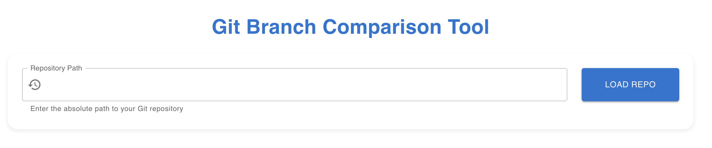

# Git Compare

A powerful desktop application for comparing Git repositories and visualizing differences between branches, commits, and files. This tool helps developers easily track and analyze changes across their Git projects.



## Features

- 📂 Easy repository selection through a user-friendly interface
- 🔄 Compare different branches within the same repository
- 📊 Visual diff representation of file changes
- 🎯 Side-by-side code comparison
- 🔍 Advanced search and filtering capabilities
- 💻 Cross-platform support (Windows, macOS, Linux)

## Tech Stack

### Frontend
- **React.js** - UI framework
- **Electron** - Desktop application framework
- **React File Picker** - File system interaction
- **CSS3** - Styling and animations

### Backend
- **Node.js** - Runtime environment
- **Express** - Web framework
- **simple-git** - Git operations
- **CORS** - Cross-origin resource sharing

## Prerequisites

- Node.js (v14 or higher)
- Git installed on your system
- npm or yarn package manager

## Installation

1. Clone the repository:
```bash
git clone https://github.com/yourusername/git-compare.git
cd git-compare
```

2. Install dependencies:
```bash
# Install root dependencies
npm install

# Install frontend dependencies
cd frontend
npm install

# Install backend dependencies
cd ../backend
npm install
```

## Running the Application

1. Start the backend server:
```bash
cd backend
npm start
```

2. Start the frontend development server:
```bash
cd frontend
npm start
```

3. Start the Electron application:
```bash
cd ..
npm start
```

## Development

- Frontend runs on `http://localhost:3000`
- Backend API runs on `http://localhost:3001`
- The Electron app will automatically load the frontend URL

## Contributing

1. Fork the repository
2. Create your feature branch (`git checkout -b feature/amazing-feature`)
3. Commit your changes (`git commit -m 'Add some amazing feature'`)
4. Push to the branch (`git push origin feature/amazing-feature`)
5. Open a Pull Request

## License

This project is licensed under the MIT License - see the [LICENSE](LICENSE) file for details.

## Screenshots

### Repository Selection


### Diff View


### Branch Comparison


## Buy me a coffee

If you like this project, please consider buying me a coffee.

[](buymeacoffee.com/pengphy)